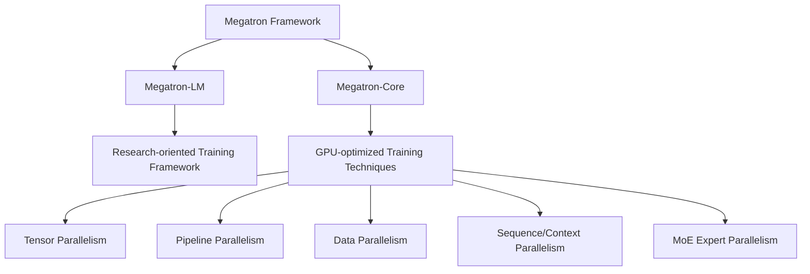

# The Ultimate Guide to Training LLMs with NVIDIA Megatron-LM

As an ML scientist working extensively with NVIDIA's Megatron-LM framework, I've found it to be a powerful tool for training large language models at scale. This guide provides a comprehensive walkthrough of the entire process, from setup to deployment.

## Understanding Megatron-LM Architecture

Megatron-LM consists of two essential components: **Megatron-LM** itself (a research-oriented framework) and **Megatron-Core** (a library of GPU-optimized training techniques). This architecture is specifically designed to train massive transformer-based models with billions of parameters across distributed GPU infrastructure.

Megatron-Core supports several advanced parallelism techniques:

- Tensor parallelism
- Pipeline parallelism
- Data parallelism
- Sequence parallelism
- Context parallelism
- Mixture of Experts (MoE) expert parallelism

